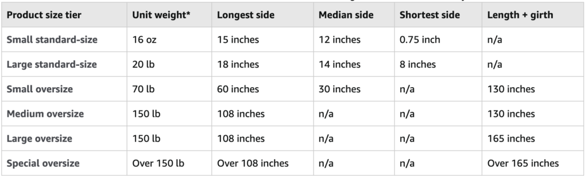
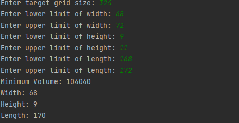

## 场景

#### 想找出一件产品在规定的周长里，找出最小的体积重以及它的所有长宽高： 周长(公式是按照：(宽+高) x 2 + 边长(最长的边))

例如: 亚马逊的产品是按照产品不同的体积来计算它的配送费用:
     

假设你需要售卖一款"Small Oversize"产品:

它的限制: 

产品+包装的重量 < 70磅, 

最长的边 < (60" Inches x 2.54) = 152cm

中等的边 < 76cm

最短的边 < (1cm 到 75cm)

Girth 计算公式： （宽+高） x 2 + Length, 不超过330 cm 也就是 130 Inches.

但凡其中一个 要求超过限制, 就会被统计成 Medium Oversize 导致费用增加.

案例：假如你要售卖一款全身镜产品

最长的边尺寸:162.5cm
宽边长：64cm 
厚：2.5cm

不确定包装的情况下, 你需向工厂定制包装,确认 girth 应该想订在 324cm.

只能自己大概算一下: 

包装的厚度 ： 在9-11 厘米

宽度 ： 68-72 厘米

边长 ： 168-172 厘米

在这些数值里，找出相应最小的体积能符合 324cm girth的预期值, 然后打印她的长,宽,高,

输入和输出:

